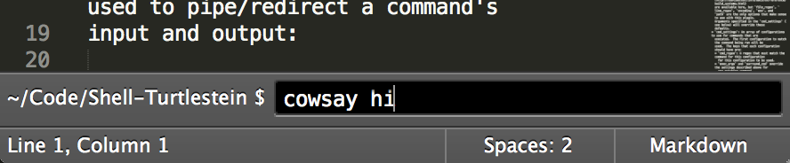
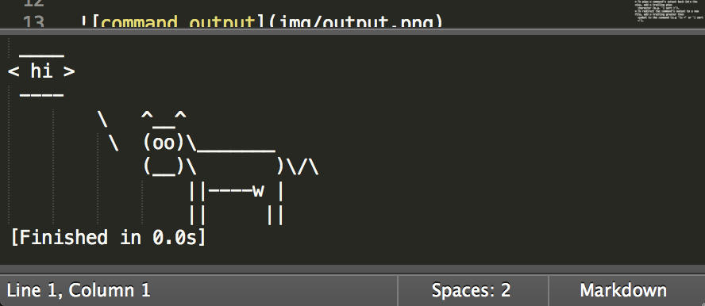

Shell Turtlestein
=================

A quick and simple way to run arbitrary shell commands in Sublime Text.

Mr. Turtlestein acts as a more flexible alternative to Sublime's build systems.
Commands run in your project's directory:

And display their output just like Sublime's build systems:

Input and output
------------------------
Unix's familiar `|` and `>` operators can be used to pipe/redirect a command's
input and output:

  * To pipe the active view's selections to a command, add a leading pipe
    character (e.g. `| sort`).  If there are no non-empty selections the entire
    file will be piped to the command.
  * To pipe a command's output back into the view, add a trailing pipe
    character (e.g. `| sort |`).
  * To redirect the command's output to a new file, add a trailing greater than
    symbol to the command (e.g `ls >` or `| sort >`).

Using snippets
--------------
Snippets are available for frequently used commands.  All snippets with the
scope name `source.shell` (`source.dosbatch` for Windows users) can be used in
the prompt shown above.  I have
[some examples](https://github.com/misfo/Sublime-Packages/tree/master/User/Snippets/Shell)
you can take a look at to get an idea for this.

Default keybindings
-------------------
* Ctrl + Shift + C (Cmd + Shift + C): prompt for a shell command
* Ctrl + Alt + Shift + C (Cmd + Alt + Shift + C): launch a terminal in the
  window's directory
* Ctrl + Shift + X (Cmd + Shift + X): re-run the previous command

Optional Configuration
----------------------
In your own `Packages/User/Shell Turtlestein.sublime-settings` file you can
override the following settings:

  * `surround_cmd`: A two-element array that specifies text to append before and
    after the command (e.g. `["source ~/.profile && ", ""]`).
  * `exec_args`: The arguments that will be passed to `ExecCommand`.
    The same
    [options that are available to build systems](http://sublimetext.info/docs/en/reference/build_systems.html)
    are available here, but `file_regex`, `line_regex`, `encoding`, `env`, and
    `path` are the only options that make sense to use with this plugin.
    Arguments specified in the `cmd_settings` (see below) will override these
    defaults.
  * `cmd_settings`: An array of configurations to use for commands that are
  	executed.  The first configuration to match the command being run will be
  	used.  The keys that each configuration should have are:
  	* `cmd_regex`: A regex that must match the command for this configuration
  	  for this configuration to be used.
  	* `exec_args` and `surround_cmd` override the settings described above for
      any matching command.
  * `prefer_active_view_dir`: If set to true, prefer using the directory of
    active file over using a folder open in the current project.

PAQ
---
Q: Who the balls is Shell Turtlestein?

A: He was a pet turtle that died in some episode of Modern Family.  That's about
   as high-brow as my references get.  R.I.P. Shell :(

Q: What does "PAQ" stand for?

A: Possibly asked questions

Thanks!
-------
Thanks to all the
[contributors](https://github.com/misfo/Shell-Turtlestein/graphs/contributors).
I'd give you all high fives if my arm would fit through the internet.
